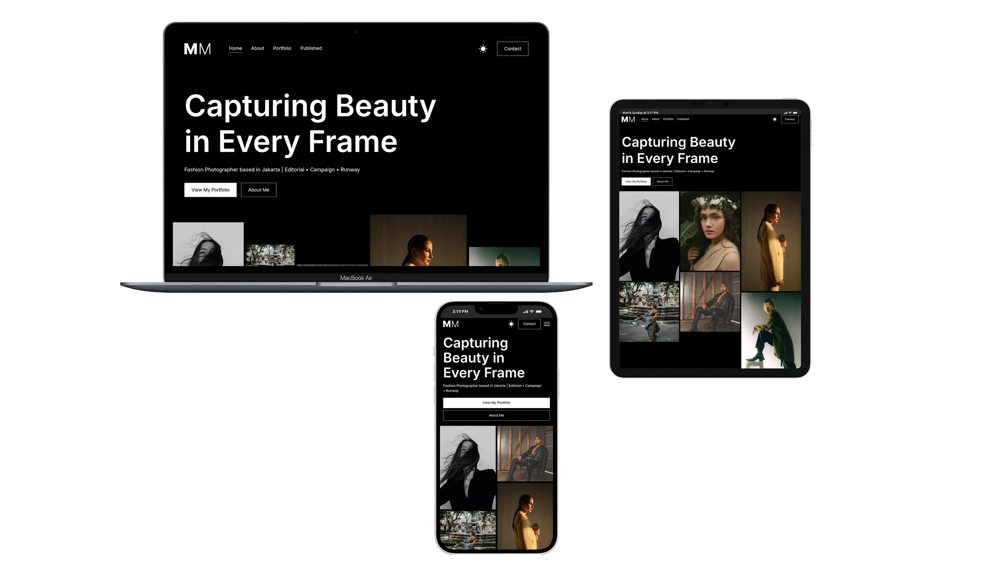

# MAX MORGAN

**Role:**  
Front-End Developer | Responsive Design | Portfolio Website | UI/UX | JavaScript Animations

🌐 [View Live Project](https://oleksandrmul.github.io/max-morgan/)

**Capturing Beauty in Every Frame**  
Fashion Photographer based in Jakarta  
Editorial • Campaign • Runway

---

## Overview  
MAX MORGAN is a **multi-page portfolio website** created for a fashion photographer and creative professional. The project focuses on visual storytelling, minimalism, and smooth interactions, allowing photography to remain the main focus while supporting SEO through a structured multi-page approach.

---

## Key Achievements  
- ✅ Built a **dual-theme interface (light & dark)** with a custom color theme switcher.  
- ✅ Implemented **parallax animations** on the homepage gallery, creating depth by moving cards at different speeds and directions during scroll.  
- ✅ Added parallax card interactions on the **Published** page, with direct links to the photographer’s Instagram work.  
- ✅ Developed a **sticky content section** on the portfolio detail page, where images appear sequentially during scroll for a storytelling effect.  
- ✅ Implemented **interactive hover states** across navigation, buttons, and gallery cards.  
- ✅ Created a **Contact popup modal** with a validated contact form.  
- ✅ Ensured full **responsive behavior**, accessibility for screen readers, and performance optimization.  
- ✅ Added a **preloader** for a smooth initial loading experience.  
- ✅ Applied subtle **scroll-triggered micro-animations** to enhance content flow without distraction.

---

## Outcome  
The result is a **clean, modern, and visually immersive portfolio website** that highlights photography through motion, contrast, and structure while remaining user-friendly and business-ready.

---

## Conclusions  
This project demonstrates my ability to build **creative portfolio websites** that balance strong visuals with usability, accessibility, and responsive design.  
If you’re looking for a developer who understands both **design aesthetics and technical reliability**, I’d be happy to collaborate.
